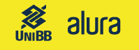

<h1 align="center">
  
</h1>

   

 

## 💻 Sobre este repositório

Neste espaço estão armazenados os cursos que realizei na plataforma Alura, disponibilizada aos funcionários do Banco do Brasil por sua Universidade Corporativa (UniBB).

------

## 🚀 Lista de cursos realizados

-  <a href="/csharp-parte1">**C# parte 1: Primeiros passos**</a>
-  <a href="/csharp-parte2">**C# parte 2: Introdução à Orientação a Objetos**</a>
-  <a href="/csharp-parte3">**C# parte 3: Entendendo herança e interface**</a>
-  <a href="/csharp-parte4">**C# parte 4: Entendendo exceções**</a>
-  <a href="/csharp-parte5">**C# parte 5: Bibliotecas DLLs, documentação e usando o NuGet**</a>

`Dentro de cada diretório há o README com o detalhamento e certificado do respectivo curso.`

